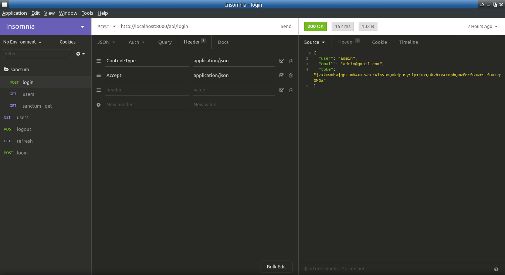
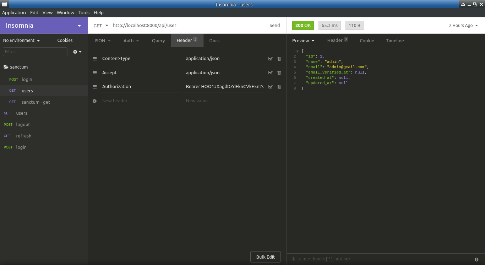

Step by step I how to make api user login with sanctum
### Installation
You may install Laravel Sanctum via Composer:
```bash
composer require laravel/sanctum
```

Next, you should publish the Sanctum configuration and migration files using the vendor:publish Artisan command. The sanctum configuration file will be placed in your config directory:

```bash
php artisan vendor:publish --provider="Laravel\Sanctum\SanctumServiceProvider"

```

Finally, you should run your database migrations. Sanctum will create one database table in which to store API tokens:

```bash
php artisan migrate
```
### Middleware
Next, if you plan to utilize Sanctum to authenticate an SPA, you should add Sanctum's middleware to your api middleware group within your **app/Http/Kernel.php** file:
```bash
use Laravel\Sanctum\Http\Middleware\EnsureFrontendRequestsAreStateful;

...

'api' => [
    EnsureFrontendRequestsAreStateful::class,
    'throttle:60,1',
    \Illuminate\Routing\Middleware\SubstituteBindings::class,
],

...
```

### Authenticating

To authenticate your SPA, your SPA's login page should first make a request to the /sanctum/csrf-cookie route to initialize CSRF protection for the application:  

Once CSRF protection has been initialized, you should make a POST request to the typical Laravel /login route. This /login route may be provided by the laravel/ui authentication scaffolding package.

### Laravel/UI

Laravel's laravel/ui package provides a quick way to scaffold all of the routes and views you need for authentication using a few simple commands:

```bash
composer require laravel/ui

```

### Create a controller

It's necessary for use a route and make login
```bash
php artisan make:controller UserController
```

### Create a route for Controller

this route is make in file routes/api.php
```bash
Route::post('/login', 'UserController@login');
```

### Protecting Routes

this route has protected for middleware sanctum

```bash
Route::middleware('auth:sanctum')->get('/user', function (Request $request) {
    return $request->user();
});
```

now is necessary your create a user for testing the route

we go use the [seeder](https://laravel.com/docs/7.x/seeding#writing-seeders) for it

```bash
php artisan make:seeder UserSeeder
```


Now you may use the *db:seed* Artisan command to seed your database. By default, the *db:seed* command runs the DatabaseSeeder class, which may be used to call other seed classes. However, you may use the **--class** option to specify a specific seeder class to run individually:
```bash
php artisan db:seed --class=UserSeeder
```

in UserController implements the code below

```bash
<?php

namespace App\Http\Controllers;

use App\User;
use Illuminate\Http\Request;
use Illuminate\Support\Facades\Hash;
use Illuminate\Validation\ValidationException;

class UserController extends Controller
{
    public function login(Request $request)
    {
        $request->validate([
            'email' => 'required|email',
            'password' => 'required'
        ]);

        $user = User::where('email', $request->email)->first();

        if (! $user || ! Hash::check($request->password, $user->password)) {
            throw ValidationException::withMessages([
                'email' => ['The provided credentials are incorrect.'],
            ]);
        }

        $token =  $user->createToken($user->id)->plainTextToken;

        return response()->json([
            'user' => $user->name,
            'email' => $user->email,
            'token' => $token
        ],200);
    }
}
```
image preview for request login



image preview for request return



## License

The Laravel framework is open-sourced software licensed under the [MIT license](https://opensource.org/licenses/MIT).

